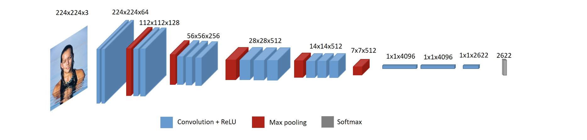

# Deepface
The notebook path is 'Deepface/Deepface.ipynb'
## Information about Deepface model :
Deepface (Gender): is based on the research article of the computer vision group of ETH Zurich. The model is using the VGG_Face model built with Keras and for the training, they used a transfer learning (by using pre-trained weights of vgg-face model and retrain the model with wiki and imdb dataset) ([source code](https://github.com/serengil/deepface))


### Training data
After initializing the model with the weight from the original model and freeze all layers except last 3 convolution layers, the model was retraind with pruned wiki and imdb datasets (removing images with no face or multiple faces, with no gender and with threshold less than 3)

## Requirements
numpy,  pandas, deepface, sklearn, os, cv2, sys,re, scipy, tarfile, zipfile

## Data

All datasets are saved [here]( 175.238.89:/bigdisk/gender_inference/Unpruned_data/ )in .zip or .tar format. They should not be modified or de-archived. Following data is used:

* wiki: 62304 images as a .tar.bz archive
* IMDB: 460723 images as a .tar archive
* Twitter: 3326 images as a .zip archive
* Scholar: 2 csv files with image URLs
* OUI: 19370 images as a .zip archive
* Gender Shade: 1270 images as a .zip archive

#### You have to create a folder called "Data" and put the original data in this folder.

## Image Processing:
1. De-archive the images and store a path to images 
2. Save image URLs to the list "images" (they might be in one folder or several folders)

## Running deepface:

1. Load the gender model from deepface
```models = {}
models["gender"] = Gender.loadModel()
```
2. The prediction are made in deepface function which takes as input image_path.
3. The resulted gender is based on the confidence score (the threshold is 50%)
4. The model return image name and the gender
5. The resulted output contains image name, predicted gender. Results are saved in "Data" folder in CSV format.

## Extracting annotations:

### The format of annotation files:

* imdb and wiki: .mat files where gender is indicated as 1.0 if male and 0.0 if female
* twitter: a .csv file for each folder of images where gender is indicated as 'indicated_gender' equal to 'male or 'female' and 'orga' (this is after processing, only those annotations are taken where 'indicated_gender:confidence' >= 0.8)
* gender_shade: a .csv file where gender is indicated with 'Female' or 'Male'
* scholar: a .xlsx file where gender is indicated with 'F' or 'M'
* OUI: 5 .txt documents with :  user_id, original_image, face_id and gender 

### The process for extracting annotations:
####  OUI: 
1. we read each file as Dataframe first and then append all the files to one dataframe. 
2. After that we create new column: "Image_name" each row of this column has the following format: 'user_id'+'/'+ 'face_id'+'.'+'original_image'( format the image name in the annotation dataframe to be the same as images)
3. we delete all the columns except for "Image_name" and "gender"

## Calculating performance measurements

1. The metadf from annotations and predicted results are merged into one dataframe
2. The confusion matrix (from sklearn) is printed based on true and predicted values (columns 'predicted_gender' and 'gender' respectively)
3. The classification report (from sklearn) is created and overall precision, recall and f-1 score are calculated as weighted average metrics.
